# ChMac - Windows Command to Change MAC Addresses of Network Adapters (chmac.bat)

Named after getmac and chmod, `chmac` is a command-line-interface (CLI) tool for Windows that changes or randomizes MAC addresses of specified network adapters, e.g. for a client device to reuse public Wi-Fi hotspot that has exceeded usage limit for the day (e.g. hotels, restaurants), or to enhance security.

An easy-to-use interactive console is available, alongside command-line parameters, e.g. for scheduling jobs with Task Scheduler. ChMac also has built-in support for recurrence.

For a quick start, refer to [Examples](#Examples) section. Scroll down for more screenshots.

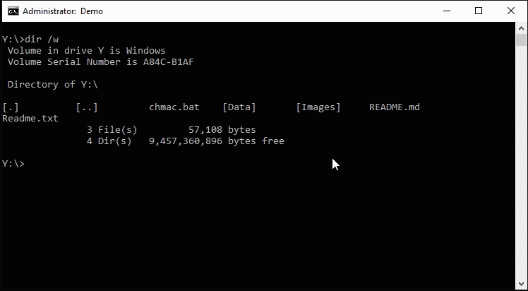

For download of the latest version (portable application & per-user/all-users installer), please visit GitHub Releases:

- [Download ChMac](https://github.com/wandersick/chmac/releases)

After downloading and extracting ChMac.zip, ChMac.bat portable application can be used immediately. Alternatively, Setup.exe (optional) provides installation into Current User or All Users location.

For users of [Chocolatey](https://chocolatey.org/packages/chmac) and `winget` repositories who prefers unattended installation into All Users location:

- `choco install chmac`
- `winget install chmac`

*Note for winget users: Please ignore the [warning from SmartScreen](https://live.staticflickr.com/65535/49987155847_d781799e16_o.gif), where you may safely click 'more info' to complete installation.

## List of Features

- Change MAC addresses on Windows automatically or manually
  - Automatically change MAC addresses on set intervals
    - Useful to reconnect to free public Wi-Fi hotspots that impose a time limit by recognizing MAC addresses to prevent the same device from reconnecting
- Randomize MAC addresses for better security using public Wi-Fi
  - Generate new MAC addresses randomly based on a customizable list of organizationally unique identifiers (OUI)
- Optionally leverage DevCon.exe to simply the process by automatically disabling and re-enabling network interface card (NIC)
  - ChMac also works without DevCon by showing the Network Connections folder when finished, so that users can manually disable and re-enable NIC for new settings to take effect
  - On first launch, users are guided to download DevCon with convenient automatic and manual options
- Restore original MAC address
- Error checking and rich return codes for scripting and other possibilities
- Free and open-source software written in Windows batch language
- Supports Windows 2000/XP/Vista/7/8/8.1/10 and Server 2000/2003/2008/2012/2016/2019
- Portable by default. Optional installer enables `chmac` command globally (in Command Prompt and Run prompt. For PowerShell prompt, the command would be `chmac.bat`)
- Easy-to-use interactive console as well as accepting command-line parameters
  - Just follow instructions on screen for using the interactive console. For command-line mode, see the following

## How It Works

ChMac works by querying a list of network adapters from Windows registry under `HKEY_LOCAL_MACHINE\SYSTEM\CurrentControlSet\Control\Class\{4D36E972-E325-11CE-BFC1-08002BE10318}`.

Based on user selection, ChMac updates the registry key responsible for the MAC address, `NetworkAddress`, of the corresponding adapter with an inputted or randomized MAC address from customizable OUI lists, either ad-hoc or automatically with Task Scheduler or its built-in auto-changing mechanism.

After MAC address is updated, the network adapter will be automatically disabled and re-enabled if an OS-specific DevCon.exe (a separate download from Microsoft) is available in the OS (the environmental variable, `PATH`) or under ChMac dependency directory, `ChMac\Data\3rdparty`. For more details, refer to [Dependencies](#Dependencies) section.

If DevCon is unavailable, the Network Connections window will be presented to user where network adapter can be disabled and re-enabled manually.

## Syntax

chmac.bat `[/d dir][/l][/m address][/n id][/r][/help][/?]`

## Parameters

```
/d dir        :: working directory - maybe required
                 (MUST be specified before other parameters)
/l            :: list network adapters and their IDs
/m            :: new mac address to be applied.
/n            :: adapter to be applied new mac address if /m is unspecified
                 new mac address will be randomized (OUI kept) and automatically filled in
/r            :: restore to original MAC address
/a            :: auto-change interval
                 suffix may be s for seconds, m for minutes, h for hours or d for days
                 e.g. enter '20m' to recur every 20 mins. [X] to reset or exit
```

When no parameter is specified, interactive mode is entered on launch.

## MAC Address Format
  
The MAC address format can be any of the following:

```
AB-CD-EF-12-34-56
AB:CD:EF:12:34:56
AB.CD.EF.12.34.56
AB CD EF 12 34 56            :: without any separation in between at all
```

**Note**: To increase success rate of changing MAC addresses in Windows Vista and later OS, the OUI lists included in ChMac contains MAC addresses which starts with `02` only

## Examples

### Command-Line Mode

```
chmac /l                     :: list available adapter IDs
chmac /n 1                   :: update network adapter #1 with randomized mac address numbers
chmac /m 00301812AB01 /n 2   :: update network adapter #2 with the new mac address: 00-30-18-12-AB-01
chmac /n 3 /r                :: restore adapter 3 to its original MAC
chmac /n 4 /a 20m            :: auto-change MAC per 20 minute
chmac /?                     :: shows short help. [/help] for long
```

### Interactive Mode

Simply run `chmac.bat` and follow on-screen instructions.

## File Structure

```
ChMac                      :: Main directory
│   chmac.bat              :: Main script
|   Setup.exe              :: Optional installer enabling chmac command globally (in Command Prompt and Run prompt)
│   Readme.txt             :: Documentation
│
└───Data
    │   OUI_NT5.txt        :: Customizable list of organizationally unique identifiers for Windows XP/2003 and earlier
    │   OUI_NT6.txt        :: Customizable list of organizationally unique identifiers for Windows Vista and later
    │   _choiceMulti.bat   :: Sub-script by wandersick for providing a fallback to systems without choice.exe (XP/2003)
    │   _choiceYN.bat      :: Sub-script by wandersick for providing a fallback to systems without choice.exe (XP/2003)
    │
    └───3rdparty           :: Dependencies put to the top of PATH (higher priority than system PATH entries)
        │   grep.exe       :: GNU Linux utility included
        │   libeay32.dll   :: GNU Linux library included
        │   libiconv2.dll  :: GNU Linux library included
        │   libintl3.dll   :: GNU Linux library included
        │   libssl32.dll   :: GNU Linux library included
        │   sed.exe        :: GNU Linux utility included
        │   sleep.exe      :: GNU Linux utility included
        │   tr.exe         :: GNU Linux utility included
        │   wc.exe         :: GNU Linux utility included
        │   wget.exe       :: GNU Linux utility included
        │   which.exe      :: GNU Linux utility included
        │   devcon.exe     :: Optional: place OS-specific devcon.exe from Microsoft here
        │
        └───LP             :: Dependencies put to the bottom of PATH (lower priority than system PATH entries)
                Readme.txt :: Reminders for LP directory
                choice.exe :: Optional: already included in OS since Windows Vista
                getmac.exe :: Optional: already included in OS since Windows XP/2003
                reg.exe    :: Optional: already included in OS since Windows XP/2003
```

## OUI Files

OUI (organizationally unique identifier) files are available in ChMac. Add desired OUIs there for randomization while using the [G] command to generate a new MAC address.

- Not all OUIs work - begin with `02` for a higher success rate on Windows Vista or later.
  - For technical details, see: http://blog.technitium.com/2011/05/tmac-issue-with-wireless-network.html

Filenames:

- `OUI_NT5.txt` - for Windows 2000, XP and 2003
- `OUI_NT6.txt` - for Windows Vista and later

File Content (Default):

```
Vendor=OUI
3Com=020475
Atheros=021374
Broadcom=020AF7
Cisco=020D28
Intel=020CF1
Linksys=020E08
Bigfoot=021903
Marvell=025043
NVIDIA=02044B
Realtek=02E04C
VIA=02127B
```

## ChMac in Action (Screenshots)

### Command-Line Mode

Display short help - `chmac /?`

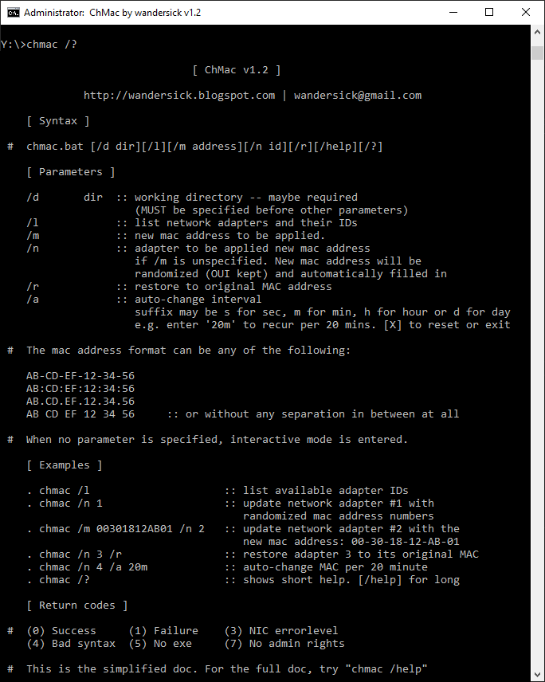

**1**: List available network adapters - `chmac /l`

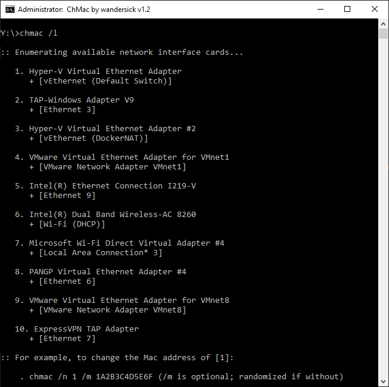

**2**: Change MAC address of adapter #6 with a random MAC address - `chmac /n 6`

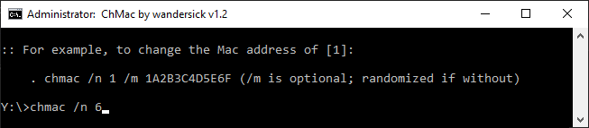

**3**: In case DevCon.exe is unavailable, Network Connections window will automatically be presented where user can manually disable and re-enable adapter

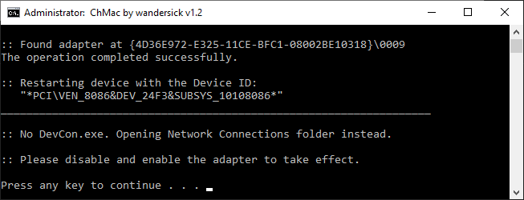

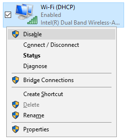

The above is only needed if DevCon.exe unavailable. Refer to [Dependencies](#Dependencies) section for more information.

**4**: MAC address successfully changed


### Interactive Mode

**5**: Interactive mode (with an additional option for auto-changing) - `chmac.bat`

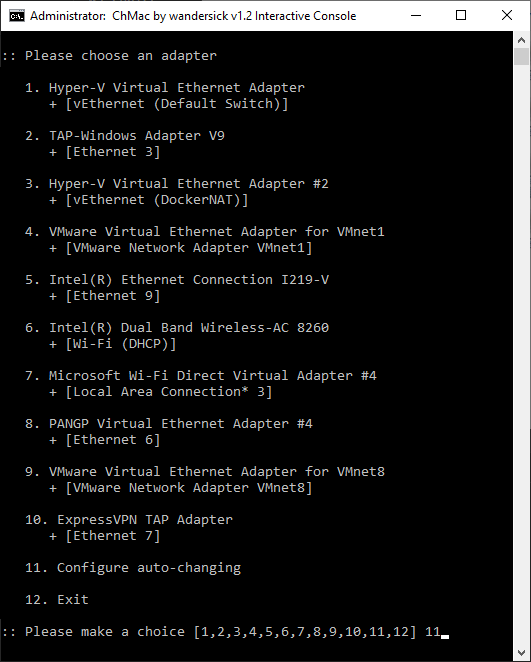

**6**: Interactively configure auto-changing interval with a 20-min interval - `20m`

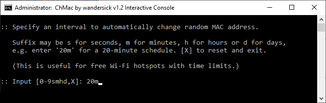

**7**: Afterwards, select adapter #6 so that its MAC address is auto-changed every 20 mins - `6`

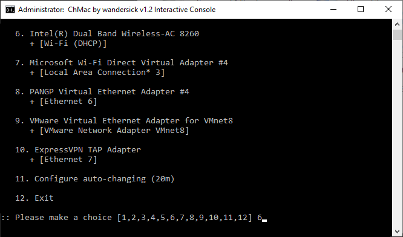

**8**: MAC address successfully changed and waiting for next auto-changing cycle

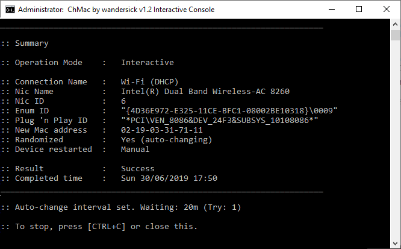

**9 (Bonus)**: Press R after choosing an adapter (while not in auto-changing mode) to restore original MAC address - `R`

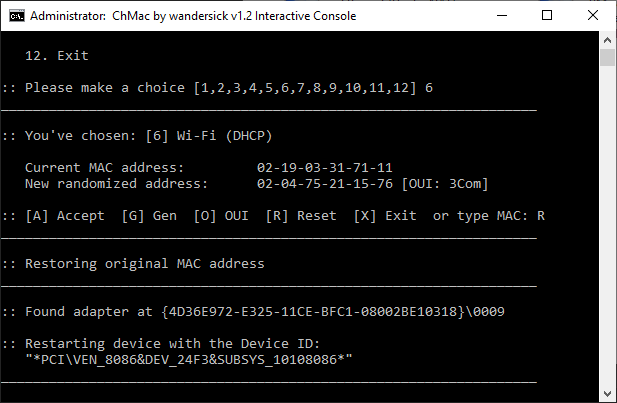

Likewise, if required, press `O` to edit OUI lists using system-default text editor.

## Requirements

All Windows operating systems from Windows 2000 and up (Windows 10 1809 at the moment) are supported.

- To use this in Windows 2000 or some minimal Windows PE, place these files from another machine which runs English Windows XP or 2003: `msvcp60.dll` as well as `getmac.exe` and `reg.exe` into `ChMac\Data\3rdparty\LP`.

### Admin Rights

Admin rights are required for editing MAC addresses, disabling and re-enabling network adapters.

- Since version 1.3, ChMac automatically elevates itself if there is no admin rights when User Account Control (UAC) is enabled in the system

### Dependencies

ChMac wraps around DevCon (optional), Windows-native and GNU Linux utilities

All of the below dependencies are either optional or do not require attention, as most of them are included already.

- Optionally enhances ChMac using `DevCon.exe`, Microsoft Windows Device Console which can be downloaded during first launch of the script
  
  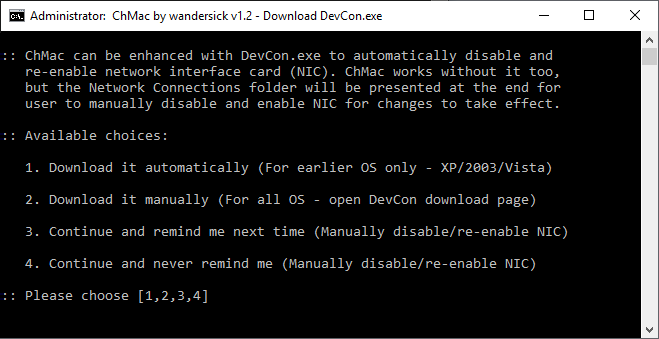

  - Beware of the version to download as there are lots of DevCon versions for different OS. See https://superuser.com/a/1099688/112570

- Unix utilities leveraged by ChMac are included already:
  `tr.exe`, `sed.exe`, `which.exe`, `sleep.exe`, `wc.exe`, `wget.exe`, `grep.exe`

- Other OS built-in dependencies natively in Windows since Windows XP:
  `getmac.exe`, `reg.exe`, `msvcp60.dll`

- Optional OS built-in dependency natively in Windows since Windows Vista:
  `choice.exe`, automatically falling back to `set /p` if unavailable or when there are more than 8 network adapters, thru a sub-script, `_choiceMulti.bat` - https://github.com/wandersick/ws-choice
  - `choice.exe` may be put here to enhance experiences in OS earlier than Windows Vista or Server 2003
  - Do not copy `choice.exe` from Windows Vista or later but the one in Windows Server 2003 or Windows Resource Kit (9x/NT)

Notes

- `getmac.exe` and `reg.exe` should be put inside `ChMac\Data\3rdparty\LP` (low priority) so that they do not override the version in the OS when a better version is available natively thru the OS
- Other executables should be put inside `ChMac\Data\3rdparty` (high priority) so that they override the version in the OS in case one is available natively thru the OS

## Return Codes / Error Messages

Return code: 0

- Cause
  - Success

Return code: 1

- Cause
  - Failure


Return code: 3

- Cause
  - NIC error
- Messages
  - Error: No network adapter found
  - Error: Adapter in a nonoperational state
  - Error: Adapter unplugged. Please connect first

Return code: 4

- Cause
  - Bad syntax
- Messages (and related parameters)
  - Syntax Error: Working directory (/d)
  - Syntax Error: Wrong address length (/m)
  - Syntax Error: Not hexadecimal (/m)
  - Syntax Error: Not digit (/n)
  - Syntax Error: Not digit or smhd (/a)
  - Syntax Error: Working directory (/d)
  - Syntax Error: Missing parameter /n (/m)
  - Syntax Error: Please use "/" instead of '-'
  - Syntax Error: Unknown parameter
  - Syntax Error: Adapter ID unavailable (/n)

Return code: 5

- Cause
  - No exe is found
- Messages
  - Error: No reg.exe. Place one from Windows in "ChMac\Data\3rdparty\LP"
  - Error: No getmac.exe. Place one from Windows in "ChMac\Data\3rdparty\LP"

Return code: 7

- Cause
  - No admin rights
- Messages
  - Error: No admin right. Please run as admin

## Limitations

1. Some virtual adapters may be unsupported
2. Randomization logic randomizes numbers (0-9) instead of hexadecimal (0-9, A-F)

## Word of Mouth

Below is one of the kind comments left by ChMac users. (Thanks!)

- "[Will keep this one handy!](https://twitter.com/NassimSpace/status/1184248919649411073)"

## Release History

| Ver | Date | Changes |
| --- | --- | --- |
| 2.0 | 20200627 | - Add setup.exe for an installation option alongside existing portable mode, adding to Run prompt and PATH environmental variable to enable the 'ChMac' command anywhere for ease of use<br>- Fix (remove) EnableLUA debug message that is displayed during UAC elevation<br>- Wrap exclamation marks around ChMacDir variable to handle parentheses<br>- Fix a bug where ChMac (Command Prompt) does not totally exit at the end<br>- Improve UAC elevation mechanism so that it supports Run prompt |
| 1.3 | 20200614 | - Elevate as administrator as needed when User Account Control (UAC) is enabled in the system |
| 1.2 | 20190629 | - Improve compatibility on Windows 10 by changing binaries of GNU Linux utilities<br>- Handle cases when the system PATH variable contains parenthesis  |
| 1.1 | 20120916 | Interim release |
| 1.0 | 20100124 | First released in 2010 |
